# [MAX7219 & KW4-56NCWB-P-Y Usage]

This document references the [KW4-56NXWB-P-Y manual](/datasheets/LED/KW4-56NXWB-P-Y.pdf), [MAX7219/MAX7221 manul](/datasheets/LED/max7219.pdf), and [luma.LED_Matrix](https://luma-led-matrix.readthedocs.io/en/latest/)

# Section I: Check "Liveness"
### **Hardware connection**:

**MAX7219 pinout** \
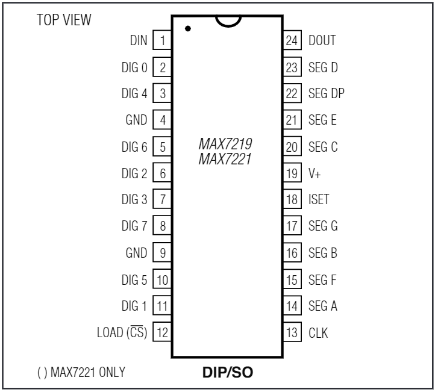

**KW4-56NCWB-P-Y pinout** \
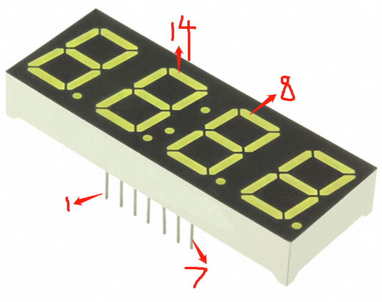

**PI to MAX7219**

* GPIO 8 (CE0) to pin 12 (LOAD/CS)
* GPIO 10 (MOSI) to pin 1 (DIN)
* GPIO 11 (SCLK) to pin 13 (CLK)
* 5V to pin 19 (V+)
* GND to pin 4 & 9 (GND, must to connect both)

**MAX7219 to KW4-56NCWB-P-Y**

* pin 8/5/10/3/7 (DIG 7 - 3) to pin 14/11/7/10/6
* pin 22/14/16/20/23/21/15/17 (SEG DP, A-G) to pin 3/13/9/4/2/1/12/5

**MAX7219 Current limiting resistor**

* connect 20-25k&#937; resistor between pin 18 (ISET) and pin 19 (V+)

### **Software setup**:
1. make sure SPI is enabled. If not, check [this tutorial](https://luma-led-matrix.readthedocs.io/en/latest/install.html#max7219-devices)
    * type `lsmod | grep -i spi`, you should see `spi_bcm2835             7424  0` or something similar
2. install `luma.led_matrix` library by following [this tutorial](https://luma-led-matrix.readthedocs.io/en/latest/install.html#installing-from-pypi)
3. run [demo.py](https://github.com/JerryWuZiJie/go_to_bed/blob/main/demo.py) to verify everything work as expected

# Section II: Library Functions

The source code can be found [here](https://github.com/JerryWuZiJie/go_to_bed). \
The functions and classes to use the MAX7219 module are in [go_to_bed.py](https://github.com/JerryWuZiJie/go_to_bed/blob/main/go_to_bed.py) -> class LED.

All the functions and demos have comments that should be enough to understand the usage.

# Section III: Deeper Understanding of MAX7219

A common connection looks like the following. \
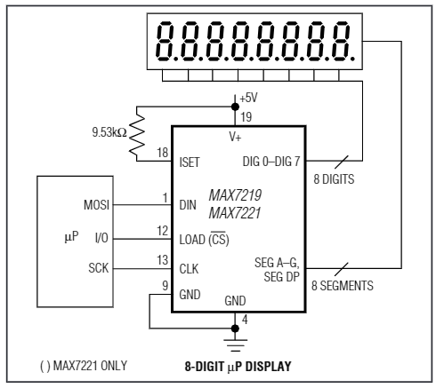

The minimum of the current limiting resistor is 9.53 k&#937;. Our LED has tipical current of 20mA and voltage of 3.2V. According to table 11 in the datasheet, we choose a resistor of 20 k&#937; \
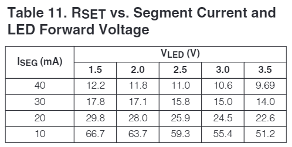

Each serial data send to the max7219 contains 16 bits, with D15-12 not care, 11-8 address bits, and 7-0 data bits, as shown in table 1 \
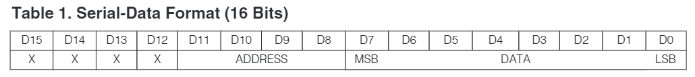

DIN will latch in data at each rising edge of CLK into a built-in shift register, and the shift register will latch in at  the rising edge of CS. Data will be clock out at DOUT 16.5 cycles later, at CLK falling edge. We will skip DOUT since we won't cascade multiple max7219.

Table 2 shows all the command and corresponding address. \
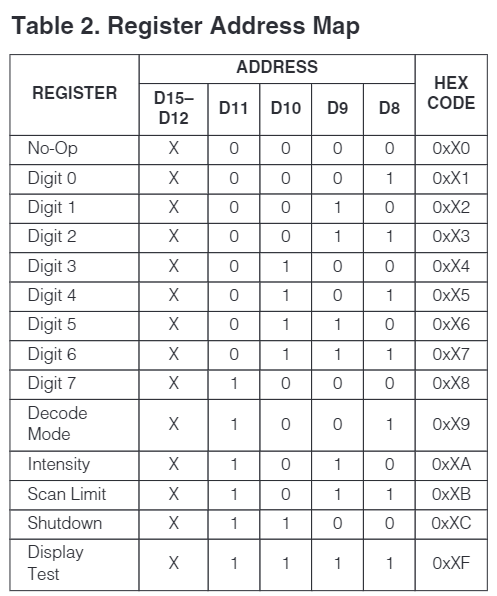

* Shutdown: when power up, the max7219 is in shutdown mode, you need to exit the shutdown mode in order for further operation \
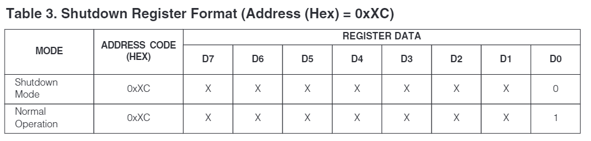

* Digit 0 - 1: indicating which digits you want the data bit to write to

* Decode Mode: each digit can be set to either decode mode or non-decode mode (check table 4). If in decode mode, check table 5 for displayed character and corresponding data bits. If in non-decode mode, each data bits controls one of the segment as shown in table 6 \
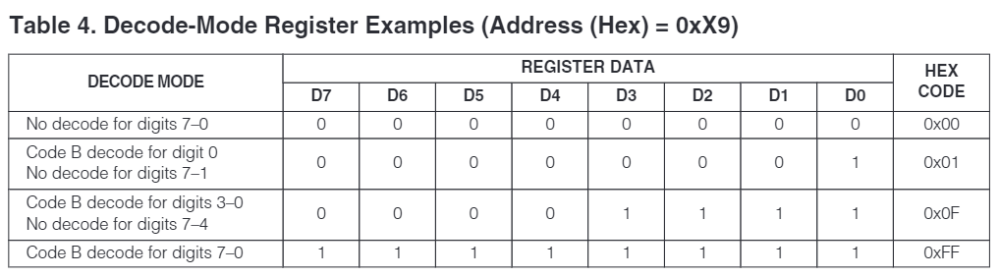 \
 \
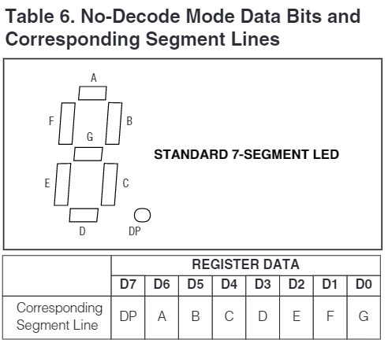 \

* Intensity: change the light intensity by using PWM. \
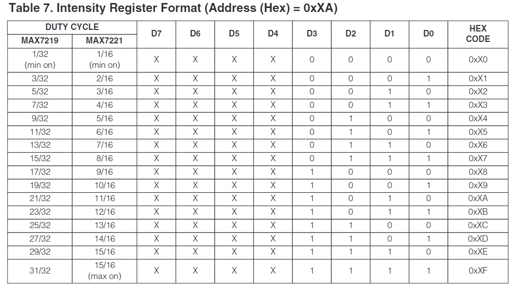

* Scan Limit: set how many digits are displayed \
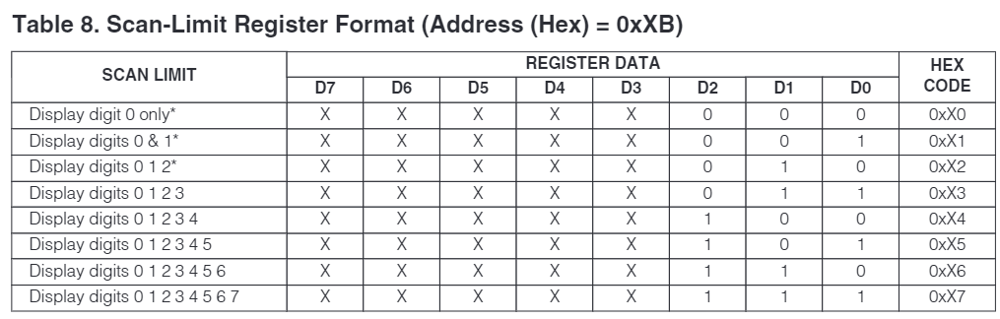

* Display Test: this will override all other command (even shutdown) but will not override what's currently in the data register. It will light up all LED at max intensity \

A demo using pure GPIO control can be found [here](https://github.com/JerryWuZiJie/go_to_bed/blob/d7c1f791657549bbe78da9d2a4f25b2224cf86c1/leddemo.py), with the same connection but changing DIG7-3 (DIG5 unconnected) to DIG0-3
