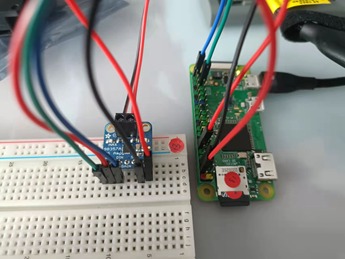
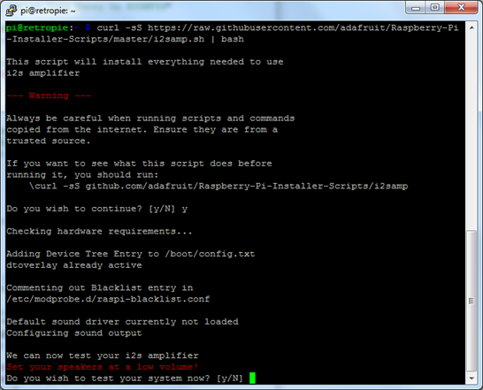
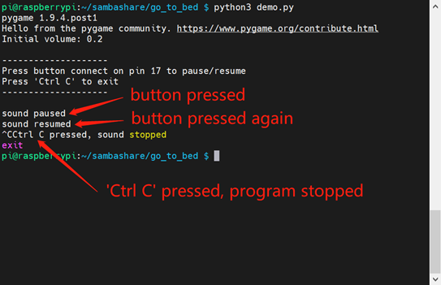

# [MAX98357 Usage](https://docs.google.com/document/d/1lCNbjpJjaGeghekCEqEAb7HH2yvS6W-WQb5ySiKuCyw/edit#heading=h.56rlp33oo5d8)

This document uses [this ](https://learn.adafruit.com/adafruit-max98357-i2s-class-d-mono-amp/overview)tutorial as a reference. You may refer to it for more detailed usage of MAX98357. \
In short, MAX98357 is a module that turns I2S digital signals into analog signals and amplifies them. \
Please email [zw1711@nyu.edu](mailto:zw1711@nyu.edu) if you have any questions related to this document.


## Section I: Check “Liveness”

### **Hardware connection**:
* MAX98357 Vin to Raspberry Pi 5V
* MAX98357 GND to Raspberry Pi GND
* MAX98357 DIN to Raspberry Pi GPIO 21
* MAX98357 BCLK to Raspberry Pi GPIO 18
* MAX98357 LRCLK to Raspberry Pi GPIO 19
* Connect the speaker to the terminal block on MAX98357

Below is a picture of what the connection looks like: \


You may notice that the “SD” and “GAIN” pins on MAX98357 are not connected. The module will work without connecting those two pins, but if you want to learn more about what they are, check [here](https://learn.adafruit.com/adafruit-max98357-i2s-class-d-mono-amp/pinouts).


### **Driver setup on Raspberry Pi Zero**:

Run the following command to install the driver (if for some reason you cannot run the script, please refer to [detailed install](https://learn.adafruit.com/adafruit-max98357-i2s-class-d-mono-amp/pinouts)):
```
curl -sS https://raw.githubusercontent.com/adafruit/Raspberry-Pi-Installer-Scripts/master/i2samp.sh | bash
```


If it prompts `Activate '/dev/zero' playback in background?`, type “N”, otherwise there might not be sound after installing. For all other prompts, type “y”, the script will reboot your PI at the end. \
After rebooting, run the script again. This time in the end it will ask if you want to test the speaker, type “y” and you should hear sound coming out from the speaker. \
(It’s recommended to reboot again so that you could use “alsamixer” to control the volume. Yet this never works for me, and you can control the volume using Python anyway. For how to use “alsamixer”, check [here](https://learn.adafruit.com/adafruit-max98357-i2s-class-d-mono-amp/raspberry-pi-usage#:~:text=Once%20rebooted%2C%20try,zero%20playback%20service.))

Test speaker: \
After installing the driver, you can use the following command to test the speaker, press ‘Ctrl C’ to stop those commands. \
Test with white noise: `speaker-test -c2` \
Test with .wav file: `speaker-test -c2 --test=wav -w /usr/share/sounds/alsa/Front_Center.wav` \

Note: this driver only supports stereo files. If your file is mono, please convert it to stereo first.

After installing the driver, the speaker you connect to PI will just act like a speaker you connect to your WIN/MAC PC, all sounds will be played from this speaker, and no need to set up again next time you reboot.


## Section II: Library Functions
The source code can be found [here](https://github.com/JerryWuZiJie/go_to_bed). You will need to install pygame to run the code. (Note: if you get `NotImplementedError: mixer module not available` error, install libsdl2-mixer-2.0-0 by running `sudo apt install libsdl2-mixer-2.0-0`; If you get error `AttributeError: module 'pygame.mixer_music' has no attribute 'unload'`, please upgrade pygame to latest version) \
The functions and classes to use the MAX98357 module are in [utils.py](https://github.com/JerryWuZiJie/go_to_bed/blob/main/utils.py) -> class Speaker. \
All the functions have comments that should be enough to understand the usage.

### **Demo Usage**:
Check [demo.py](https://github.com/JerryWuZiJie/go_to_bed/blob/main/demo.py) -> # speaker usage. You need to connect a push button to GPIO 17 and 3.3V to use the pause/resume method.
* First, you need to initialize a Speaker() object.
* Add sound you want to play by calling the <code>set_sound(<em>sound_path</em>)</code> method. The <em>sound_path </em>should be in the same directory as demo.py.
* Calling the <code>play_sound() </code>method would start playing sound in a non-blocking manner, which means the program will keep running while the sound is playing.
* Notice that the sound will stop playing if the program ends. To make the program keep running before the sound stop, check the <code>is_stopped()</code>, which returns True when the sound stopped.
* Calling the <code>pause()/resume()</code> methods with pause/resume the sound.

Below is a screenshot of what the program looks like when running (subject to changes in future modification) \
)


## Section III: Explain in Depth

### **I2S**:
There’s an I2S DAC that turns I2S signals into analog signals on the MAX98357

I²S is an electrical serial bus interface standard used for connecting digital audio devices. \
The bus consists of at least three lines:
* Bit clock line SCK (in our case BCLK)
* Word clock line WC (in our case LRC)
* Serial data line SD (in our case DIN)

Reference: [Wikipedia](https://www.wikiwand.com/en/I%C2%B2S)

### **Amps**:
There’s an amplifier to amplify the analog sound signals on the MAX98357

Amps are hard to explain in short. If you took Electronics 1, you should already know what an Amp is. If not, you can imagine Amp just as an electronic device that amplifies the input signals.

### **Music and TTS**:
Since the MAX98357 just makes your speaker part of the PI, you could play music or TTS (text-to-speech) on the PI and it will be played through the speaker. \
For the python TTS library, I recommend using [pyttsx3](https://pyttsx3.readthedocs.io/en/latest/engine.html#examples).
